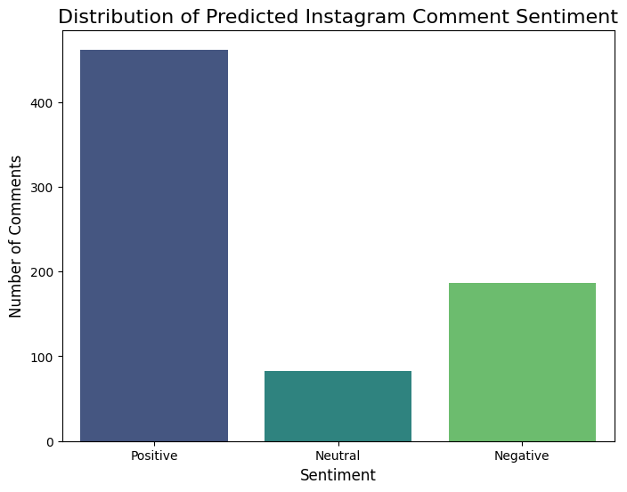

# 💬 Instagram Sentiment Analysis
This project uses Python and the NLTK library to perform sentiment analysis on a dataset of user comments. The primary goal of this project is to classify each comment as Positive, Negative, or Neutral and to evaluate the performance of a pre-trained model (VADER) on this task.

## 🎯 Problem Statement
Understanding user sentiment is crucial for brands, creators, and social scientists. This project tackles the challenge of automatically classifying text sentiment from a dataset with highly nuanced and varied emotion labels. The core task involves engineering a process to standardize these labels and then evaluating a sentiment analysis model to understand its strengths and weaknesses on real-world, noisy text data.

## 📊 Dataset
This project uses a custom dataset (sentimentdataset.csv) containing user comments and over 150 unique, fine-grained emotion labels (e.g., "Admiration," "Despair," "Curiosity"). A key part of this project was mapping these specific labels to the three primary sentiment categories: Positive, Negative, and Neutral.

## ⚙️ Project Workflow
1. Data Cleaning & Label Standardization: The initial dataset's 150+ unique emotion labels were mapped and consolidated into three standard categories (Positive, Negative, Neutral) to create a usable ground truth for evaluation.

2. Sentiment Analysis: The VADER (Valence-Aware Dictionary and sentiment Reasoner) model from the NLTK library was used to predict the sentiment of each comment.

3. Model Evaluation: The model's predictions were compared against the standardized ground truth labels to calculate performance metrics, including overall accuracy and a detailed classification report.

4. Visualization: The distribution of the predicted sentiments was visualized using Matplotlib and Seaborn to provide a clear overview of the results.

## 📈 Key Results & Findings
- The VADER model achieved overall accuracy of 54% on this challenging, nuanced dataset.

- High Performance on Clear Polarity: The model demonstrated a high recall of 86% for both Positive and Negative classes, indicating it is very effective at identifying comments with clear, strong sentiment.

- Challenge with Nuance: The model's primary challenge was with comments classified as "Neutral," where its performance was lower. This highlights a common difficulty in NLP where subtlety and context are harder to interpret than strong emotional language.



## 🚀 How to Run This Project
1. **Clone the repository**
    ````bash
    git clone https://github.com/YourUsername/YourRepositoryName.git

2. **Install the required libraries**
    ````bash
    pip install -r requirements.txt

3. **Place sentimentdataset.csv in the root folder**

    Run the main Python script or Jupyter Notebook.

## 🛠️ Tech Stack
Languages: Python

## Libraries: 
Pandas, Scikit-learn (for evaluation), NLTK (VADER), Matplotlib, Seaborn

## Author
Ajay Tiwari
B.Tech Final Year - Computer Science (Specialization in Artificial Intelligence).
Passionate about Data Analytics, and Machine Learning.

## Licence 
MIT Licence - Feel free to use, modify, and share with attribution.
